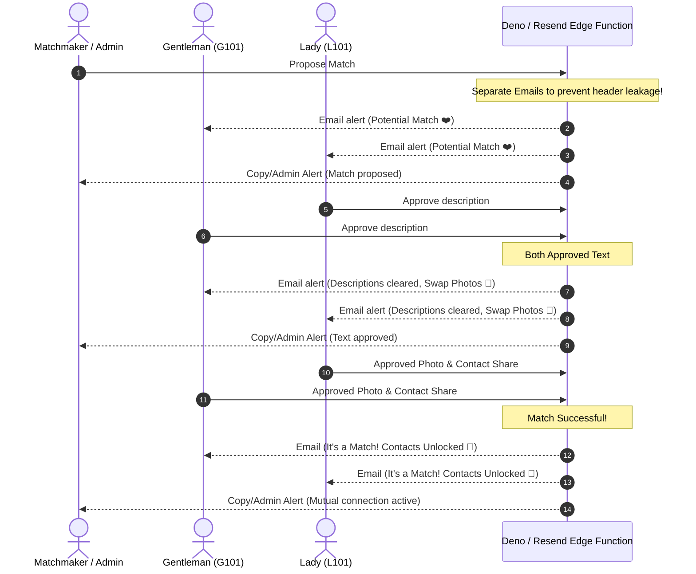

# 💖 PureMatch CRM: Secure, Free Matchmaking Portal & CRM

PureMatch CRM is a modern, high-fidelity CRM system built for matchmakers to coordinate connections while providing clients with a secure, anonymous Candidate Portal. The system is designed to be **100% free of charge**, prioritizing candidate privacy, activity analytics, and a beautiful user experience.

---

## 🚀 Key Modernization Highlights

* **100% Free Service**: All payment processing form files, dollar transaction pipelines, sales commissions, and pt packages were purged to create a streamlined, non-transactional dating matchmaker platform focused purely on activity metrics.
* **Pure Matchmaking Terminology**: Gone are the legacy gym references, attendance scanners, PT packages, and QR check-in codes. The vocabulary is now fully aligned with modern matchmaking: dating consults, regions, and profile stages.
* **Dual-Context Separation**:
  * **CRM Matchmaker Desk**: For admin and staff to manage candidate profiles, review leads, track consultations, set monthly activity targets, and propose match pairings.
  * **Candidate Portal (`/portal`)**: A beautiful, glassmorphic client interface where candidates log in to review potential partners, swap photos, and exchange contact details.

---

## 🔒 Security & Client Anonymity

Privacy is the most critical element of the matchmaking experience. PureMatch enforces security through two distinct layers:

### 1. Client-Side Dynamic Property Masking
* **Text Stage (Phase 1)**: Base client credentials (phone number, email address, WhatsApp links, full names) are completely masked on the client context. Candidates only see anonymized descriptions, hobbies, ages, faith backgrounds, and preference parameters.
* **Photo Swap Stage (Phase 2)**: Candidate photos are shielded until both individuals upload and explicitly consent to swap photos.
* **Mutual Match Success (Phase 3)**: Contact details are instantly decrypted and direct **WhatsApp chat links** are revealed only when mutual contact consent has been recorded.

### 2. Database Row-Level Security (RLS)
The Supabase PostgreSQL layer enforces bulletproof RLS structures (`supabase/candidate_portal_schema.sql`):
* Candidates can only fetch and query match data where they are a designated participant.
* Partner details are fetched under strict sub-query checks that only return verified attributes aligned with the current match progression phase.

---

## ✉️ Transactional Email Notification Swarm

Integrated with a Deno Edge Function (`supabase/functions/send-email`), PureMatch CRM automatically keeps candidates and matchmakers in sync at every milestone:



### Key Email Features:
1. **Perfect Anonymity Protection**: The Edge Function sends **separate, independent email requests** to each candidate. They never see other candidates' email addresses in email headers (preventing unintended leakage).
2. **Dedicated Admin Progress Alerts**: For every match progress event, a beautifully formatted alert is automatically sent to the assigned Matchmaker/Moderator containing candidate codes, exact status updates, internal notes, and direct dashboard links.
3. **Inactivity Warnings**: The system monitors pending proposals, alerting moderators via email if a match has stalled for over 48 hours to ensure premium-quality service.

---

## 🎨 Candidate Portal Experience

The Client Portal (`/portal`) leverages high-end design aesthetics:
* **Glassmorphic UI**: Vibrant gradient backdrops, harmonized HSL color profiles,Outfit/Inter typography, and subtle interactive micro-animations.
* **Interactive Step Progress Bar**: Visual markers mapping current progression from Profile Review to Photo Swap to Contact Shared.
* **Built-in Photo Uploader Simulator**: Allows instant image uploading and swap confirmations within a sandbox context.
* **Actionable Call-to-Actions**: Live click-to-copy numbers, email triggers, and a **Direct WhatsApp Chat button** once matched!

---

## 🛠️ Local Development & Sandbox Simulator

To dry-run match actions and verify email/notification cycles offline:

1. **Install Dependencies**:
   ```bash
   npm install
   ```
2. **Launch Developer Server**:
   ```bash
   npm run dev
   ```
3. **Access the CRM & Portal**:
   * **Admin CRM panel**: `http://localhost:5173/` (Login with Sarah, Youssef, or Matchmaker Staff using quick logins).
   * **Candidate Portal**: `http://localhost:5173/portal`
4. **Developer Sandbox Quick Login**:
   We seeded standard offline candidates (e.g., Lady `L101` and Gentleman `G101`) to allow developers to perform the entire handshake cycle directly in `localStorage` without needing active database keys.
   * Open two browser windows (one incognito).
   * Log into `L101` in window A, and `G101` in window B.
   * Approve profiles, upload simulated photos, click "Swap Photo", click "Share Contact Details", and watch details decrypt live!
   * Simulated email payloads and Resend configurations will print beautifully in your developer console (`F12`).

---

## 📁 Repository Structure

* `/src/Portal.tsx` - Candidate dashboard client portal and login routes.
* `/src/context.tsx` - AppProvider with database synchronization, audit logging, and email triggers.
* `/src/components/NotificationCenter.tsx` - CRM Staff Alert center computing stale leads and stalled matches.
* `/supabase/candidate_portal_schema.sql` - Postgres policies and RLS structures.
* `/supabase/functions/send-email/index.ts` - Deno Edge Function with separate email dispatches and admin alerts.
